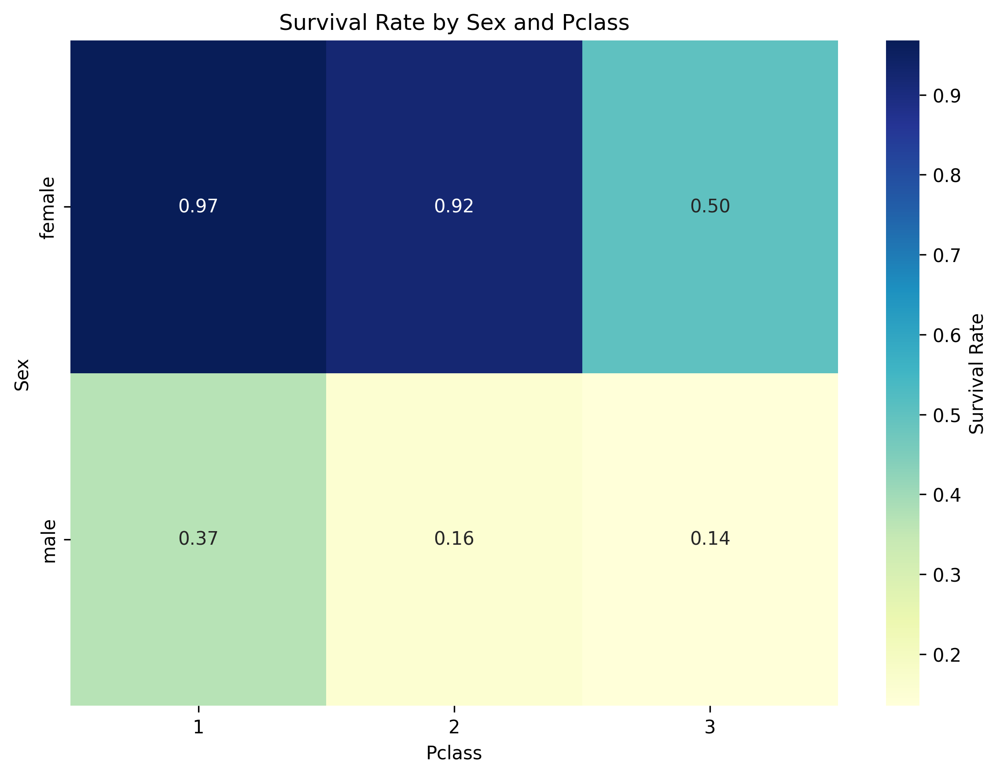
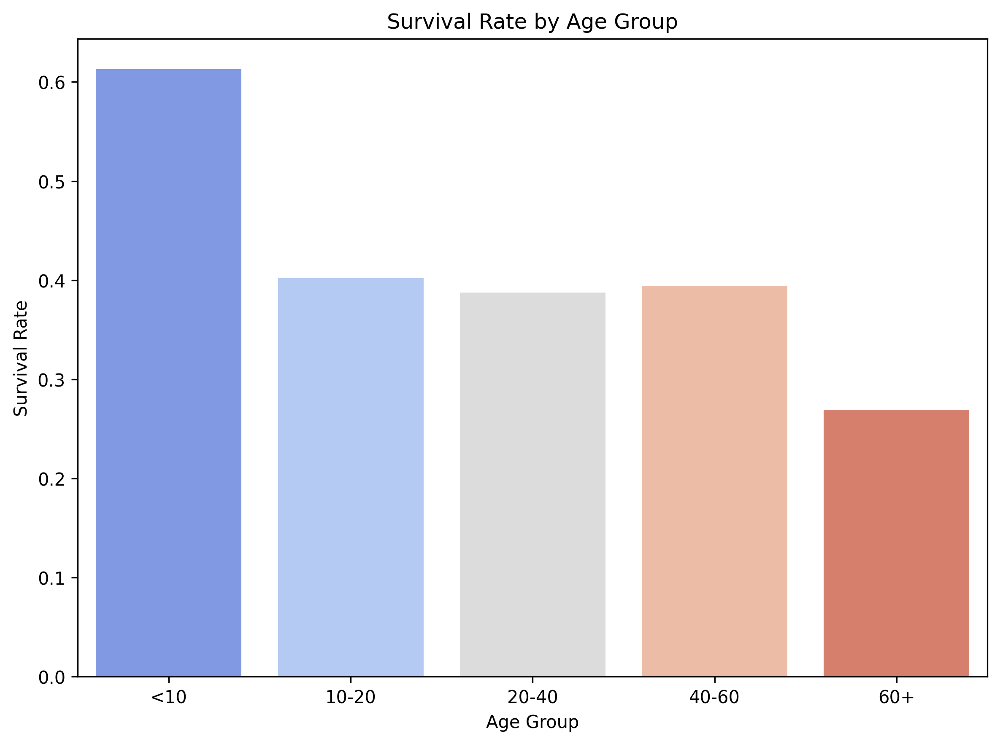

# The Temporal Rift on the Titanic: GM Guide

**Player Role:** You are a team of time travelers.
**Final Goal:** Before the ship sinks, find 5 missing 'temporal coordinate fragments'.

--- 
## Challenge 1: Purser's Office (Find the Anomaly)

**Story:** You've just boarded and been caught as stowaways. On the desk is a stack of passenger registration cards. You must identify the 'forged' card among them.

**Task:** Out of the following 6 passenger cards, which one is statistically impossible?


### Passenger Cards (Show to Players)

**Card 1**
```
name: Holverson, Mrs. Alexander Oskar (Mary Aline Towner)
Pclass: 1
Age: 35.0
Sex: female
Fare: 52.0
Embarked: S
```
**Card 2**
```
name: Duff Gordon, Lady. (Lucille Christiana Sutherland) ("Mrs Morgan")
Pclass: 1
Age: 48.0
Sex: female
Fare: 39.6
Embarked: C
```
**Card 3**
```
name: Elsbury, Mr. William James
Pclass: 3
Age: 47.0
Sex: male
Fare: 7.25
Embarked: S
```
**Card 4**
```
name: Andersson, Miss. Erna Alexandra
Pclass: 3
Age: 17.0
Sex: female
Fare: 7.92
Embarked: S
```
**Card 5**
```
name: Sage, Mr. Douglas Bullen
Pclass: 1
Age: nan
Sex: male
Fare: 2.87
Embarked: S
```
**Card 6**
```
name: Hampe, Mr. Leon
Pclass: 3
Age: 20.0
Sex: male
Fare: 9.5
Embarked: S
```

---
### GM Guide

> **Hint:** GM Hint: Refer to the box plot above. The forged card has a fare that doesn't match its class - either much higher or much lower than typical for that class. Players should compare each card's fare with the distribution shown in the chart for that card's class.
> **Answer:** [[REVEAL_ANSWER]]The forged card: 1st class (Pclass=1) but paying £2.87, which is much lower than typical 1st class fares (£5.00-512.33). **(In this game, this card is Card 5)**[[END_REVEAL]]
> **Obtain:** **Temporal Coordinate Fragment 1** hidden under the forged card.

---
## Decipher the Lifeboat Code

**Story:** The lifeboat lock requires a 4-digit code based on passengers' survival predictions.

**Task:** Predict which of the 4 passengers survived (1) or perished (0). Use the survival clues provided.





### Passenger Cards (Show to Players)

**Card 1**
```
Name: Palsson, Mrs. Nils (Alma Cornelia Berglund)
Pclass: 3
Age: 29
Sex: female
Fare: 21.07
Embarked: S
```
**Card 2**
```
Name: Brown, Miss. Amelia "Mildred"
Pclass: 2
Age: 24
Sex: female
Fare: 13.0
Embarked: S
```
**Card 3**
```
Name: Reuchlin, Jonkheer. John George
Pclass: 1
Age: 38
Sex: male
Fare: 0.0
Embarked: S
```
**Card 4**
```
Name: Laleff, Mr. Kristo
Pclass: 3
Age: 28
Sex: male
Fare: 7.9
Embarked: S
```

---
### GM Guide

> **Hint:** Use the survival charts above to infer the 4-digit lifeboat code.
> **Answer:** [[REVEAL_ANSWER]]0100[[END_REVEAL]]
> **Obtain:** **Temporal Coordinate Fragment 3** hidden within the lifeboat control panel.

---
## Letters from a Stowaway

**Story:** 
    
    The Captain has called you and your group to the deck of the ship with an 
    urgent mission. Telegrams have been intercepted from the ship's Marconi machine
    and it appears there is a stowaway on board! Unfortunately, the dastardly 
    stowaway has managed to scramble one of the telegrams using a mysterious code. 
    The Captain has created a list of 10 suspects. Can you decipher the letter and
    obtain the identity of the suspect before they get away?!
    
    

**Task:** Decode the encrypted letter and select the name from the list of suspects.

### Letters from the Stowaway 

**Plaintext Letter**```   
R.M.S. TITANIC  
MARCONI WIRELESS SERVICE  
APRIL 12, 1912
To Mr. David Smith
Good afternoon, I have snuck aboard this mighty vessel. 
Now time to implement my darstardly plan!
Yours Sincerely,

A Guest of the Deep
```
**Encrypted Letter**```
c.p.x. mkmuhkr  
pucrshk qkctntxx xtcfkrt  
ulckn 12, 1912
pi xtrctm unkux kx pc vuptx pscuh

u aytxm sb met dttl
```
### Possible suspects 

---
## Game End

Congratulations! You've collected all 5 coordinate fragments, restarted the time machine, and successfully escaped from 1912 at the moment the Titanic sank.
